# HTML

The Hypertext Markup Language defines the **structure** of a web page.
It enclose the contents of the page inside **elements** which have a significant meaning for the browser.


> HTML is not a programming language, it is a Markup language.

## Elements and Tags

Elements are enclose content between **tags**.

Tags are the starting and ending parts of an element.

For example the **p** element defines a paragraph. The starting tag for this element is `<p>` and the ending tag is `</p>`.

Then you can put content between this tags:

```html
<p>Hello this is a paragraph</p>
```

> See example above at [codes/paragraph.html](./codes/paragraph.html)

As you can see ending tags are almost equals to the starting tag, the only difference is that ending tags have a forward slash `/`.

## Attributes

Elements can have attributes that give a bit extra info to the browser.

Example, the `a` tag is used to create a link:

```html
<a href="https://www.google.com/">click to go google</a>
```

> See example above at [codes/anchor.html](./codes/anchor.html)

> Attributes must be in the starting tag, **never** in the ending tag.

As you can see, the `href` (hyper reference) attribute is used in `a` elements to provide the link we want to use. Note that the value of the attribute is enclosed between quotes, you can also use simple quotes but do not mix both.

There are some attributes that are common in the majority of elements, and other attributes that are reserved for specific elements, you will learn more attributes and elements later on this course.

## Unclosed tags

Jus a few elements does not need and ending tag. You will learn some of them throughout this course.

Unclosed tags does not have content that's why an ending tag is not needed.

> Unclosed tags are also known as  self closing tags, void tags, empty tags, singletons tags.

Examples are:

- `` for images
- `<br />` to insert a single line break
- `<hr />` to add a horizontal rule

> `br`and `hr`are example of empty tags because you rarely will add an attributes to them, you just use them as they are.

> Also note there is an space between the tag and the slash, older web browsers will have issues to understand this, therefore try to add that space.

Although you can use a slash ath the end of the tag `/>` this is not mandatory and does not give any special meaning to the browser.

The browser will remove the slashes and then render the elements:

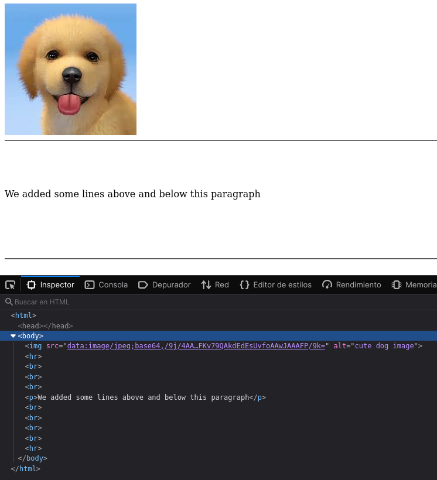

> You can see the code of the image at [codes/unclosed_tags.html](./codes/unclosed_tags.html)

HOWEVER, for XHTML (a similar language but more strict) it is required to add that slash in unclosed tags. ALSO some frameworks like **react** will trow an error if these are not closed.

📌 **Good practice**: ALWAYS "close" an unclosed tag by adding a slash at the end.

## DOCTYPE declaration

The `Doctype` declaration is an "information" to the browser about the HTML version. We can also refer to the Doctype as the **Document Type Declaration** (DTD)  

**It is NOT a tag**

that is used to specify the HTML version.

It must appear at the beginning of an HTML file. For HTML5 the syntax is a follows:

```html
<!DOCTYPE html>
```

> The Doctype declaration is NOT case sensitive, so it is not mandatory to use all letters is upper case.

## HTML tag

The `HTML` represents the root of an HTML document. It is a container for all other elements, except for the DOCTYPE.

Example:

```html
<!DOCTYPE html>
<html>
</html>
```

## Head tag

The `head` tag is used to group information about the document, e.g. title, character encoding, icon of the tab, useful metadata, etc.

Example:

```html
<!DOCTYPE html>
<html>
    <head>
    </head>
</html>
```

Let's add some elements to the `head`:

```html
<!DOCTYPE html>
<html>
    <head>
        <title>My page</title>
        <meta charset="UTF-8">
    </head>
    <p>I am not inside the head tag. México.</p>
</html>
```

> See example above at [codes/head_tag.html](./codes/head_tag.html)

This is how it looks in the browser:

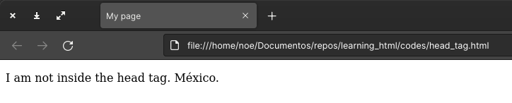

- Note the name of the tab, that was caused by the `title` tag. This tag is important for Search Engine Optimization (SEO).
- Note the `é` in `México`, we were able to see that symbol because we use `<meta charset="UTF-8">`, the `meta` tag defines metadata, in can have multiple attributes, this time we use `charset` to set the character encoding to `UTF-8` so we can see the letter `é`.

## File paths

When working with HTML you will need to refer to files in your directory. For example, you can have a menu with links to these files about.html, contact.html, blog.html, etc. what is the path for these files?

The path of these files is the address in the file structure, this address can be relative or absolute:

- **Relative**: If you want to refer to a file that is in the same directory of the current file then you can use `./otherfile.html`, here the dot means "current directory". this also works if the file is inside another directory: `./directory2/otherfile.html` this is looking for a directory called `directory2` inside the current directory and then it looks for the file `otherfile.html` within it.
  - Another relative way is using `..`, here the two dots mean "the parent directory of the current directory", let's say you have tis structure:
  ```
  myproject
  |-- dir1
  |   `-- index.html
  `-- dir2
      `-- about.html
  ```
  If you have opened index.html and you want to open about.html then the path will be `../dir2/about.html` because `..` is the parent of `dir1` that is `myproject`, then we can add the rest of the path: `myproject/dir2/about.html`.
- **Absolute**: When you specify the whole path. If you are in windows you will most likely start with `C:\`, Mac and Linux will start with `/`, for example, the absolute path of `about.html` in my computer is `/home/noe/myproject/dir2/about.html`, as you can see absolute paths have the full address in your system. If you send your project yo a friend it is very likely that the links will not work because the absolute path will be different, that's why relative files are useful.

## Body tag

The `body` tag defines the document's body, it contains all the HTML elements e.g. paragraphs, links, images, tables, etc.

> Note: Only use the `body` element once in your document.

Example:

```html
<!DOCTYPE html>
<html>
    <head>
        <title>My page</title>
        <meta charset="UTF-8">
    </head>
    <body>
        <h1>This is my page<h2>
        <p>I am not inside the head tag. México.</p>
        <h2>Hello World</h2>
    </body>
</html>
```

> See example above at [codes/body_tag.html](./codes/body_tag.html)

This is how it looks in the browser:

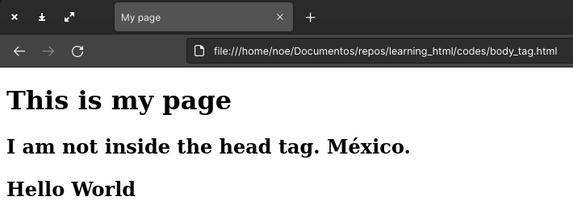

- The `h1` tag is used to add a heading, there are 6 levels for headings: `h1`, `h2`, `h3`, `h4`, `h5`, and `h6`, each heading represents the level of importance, being `h1` the most important heading. This is important for SEO.

## More about links

We already se the `a` element is used to redirect a user when the link is clicked.

This element can have a few attributes:

- `href`: (optional, but makes no sense to use the `a` element if you are not going to redirect at all) The link where we want to redirect the user.
- `title`: (optional) an small message the user will se when hovering the pointer over the link.
- `target`: (optional) specifies where to open the link, options (Do not worry if you do nto understand all the options yet):
    - `_blank`: Opens the linked document in a new window or tab
    - `_self`: Opens the linked document in the same frame as it was clicked (this is default)
    - `_parent`: Opens the linked document in the parent frame
    - `_top`: Opens the linked document in the full body of the window
    - `framename`: Opens the linked document in the named iframe

Example:

```html
<!DOCTYPE html>
<html>
  <head> </head>
  <body>
    <a
      href="https://www.facebook.com/"
      title="click here to open facebook"
      target="_blank"
      >Go to facebook</a
    >
  </body>
</html>
```

> See example above at [codes/more_about_anchor.html](./codes/more_about_anchor.html)

This is how it looks in the browser:

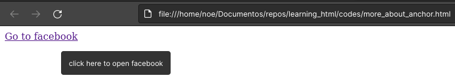

> The cursor is not shown in the screenshot but the message was shown when the user hover pointer over the link.

Do you want to create an image that links to another site?, then use an `img` element as the content of an `a` element:

```html
<!DOCTYPE html>
<html>
  <head>
    <title>image link</title>
  </head>
  <body>
    <a
      href="https://www.facebook.com/"
      title="click here to open facebook"
      target="_blank"
    >
      
    </a>
  </body>
</html>
```

> See example above at [codes/image_link.html](./codes/image_link.html)

This is how it looks in the browser:

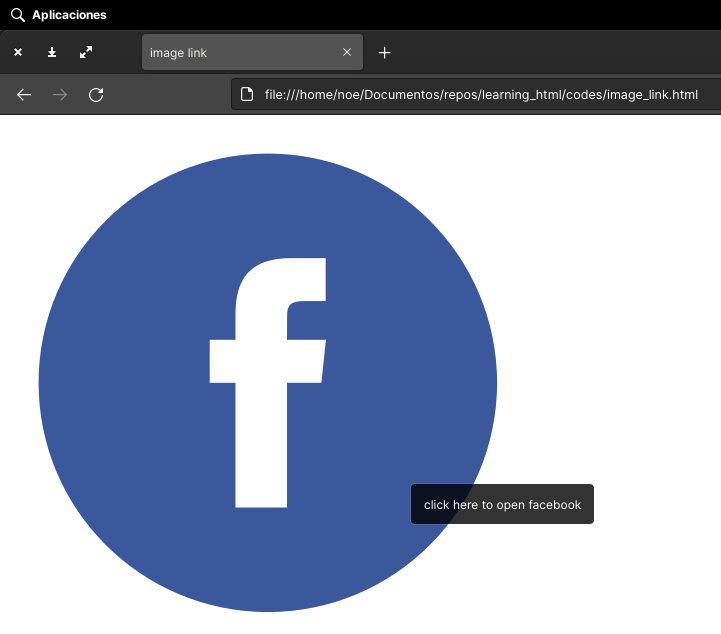

## More about images

We already saw that `img` element is used to add an image to the document.

These are some common attributes:

- `src`: Link to the image. If your image is local you can specify the path to the image e.g. ``
- `alt`: An alternative name in case the `src` was not a valid address/link/path, also this value is used if the user is using a screen reader.
- `title`: title that will appear when the user hovers the pointer over the image.
- `width`: width of the image in pixels, example `width="200"` (this will be 200 pixels).
- `height`: height of the image in pixels, example `height="300"` (this will be 300 pixels).

Example:

```html
<!DOCTYPE html>
<html lang="en">
  <head>
    <meta charset="UTF-8" />
    <meta http-equiv="X-UA-Compatible" content="IE=edge" />
    <meta name="viewport" content="width=device-width, initial-scale=1.0" />
    <title>Document</title>
  </head>
  <body>
    
  </body>
</html>
```

> See example above at [codes/more_about_anchor.html](./codes/images.html)

This is how it looks in the browser:

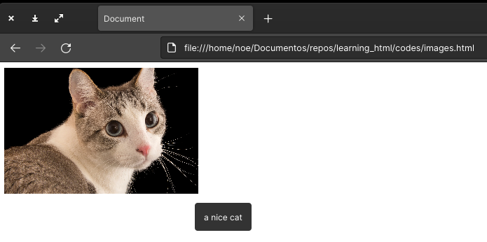

## Style attribute

The `style` attribute is used to add styles to HTML elements, that can be color, font, size, etc.

The `style`attribute is also know as **inline CSS**, because you are modifying the styles of the element in the element itself.

Example:

```html
<!DOCTYPE html>
<html lang="en">
  <head>
    <meta charset="UTF-8" />
    <title>style attribute</title>
  </head>
  <body>
    
    <p style="color: red">Hey look I'm red</p>
    <p style="color: #f00">Hey look I'm also red</p>
    <p style="font-family: 'Courier', 'Lucida Sans'; color: blue">
      I have a different font
    </p>
    <p style="font-size: 50px">I am big</p>
  </body>
</html>
```

> See example above at [codes/style_attribute.html](./codes/style_attribute.html)

This is how it looks in the browser:

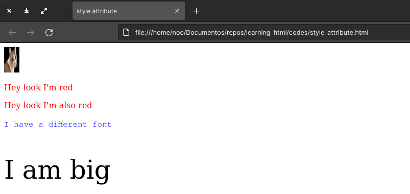

Notes:
- For `width` and `height` **styles** you need to provide the measurement `px` unlike the `width` and `height` **attributes** which are always in pixels.
- You can add multiple styles by separating each style using a semicolon `;`.
- A single style can have multiple values, as the `font-family`in this case you can separate each value using a comma `,`.
- The `font-family` style will use the first font listed, if it is not available it will try with the next and will continue to do that until one font is found for use.
- The `color` property receives a hexadecimal value (#F00 is the same as red because the first hex value is R (red), the second digit is G (green) and the last value is B (blue)) or a common color name such as red or blue, read more at [https://htmlcolorcodes.com/color-names/](https://htmlcolorcodes.com/color-names/)

Here are another common styles you can apply:

- `font-size`: Font size, the value is a number along with the measure (px for pixels), the number and the measure should be together without spaces between them.
- `text-align`: specifies the horizontal alignment, options: `left`, `right`, ``center

## Display property values

All display elements (elements that are rendered in the user interface) have a default behavior to be shown in the browser.

The display property (`style="display: <VALUE HERE>"`) specifies how and element takes place in the view.

Every element is treated as a box, the display property specifies how this box will be shown.

The most common values for the `display`property are:

- block
- inline-block
- table
- flex
- grid
- none

### Block-level elements

Some elements use `block` as the default value for the `display` property, e.g. `h1`to `h6`, `p`, `div`, etc.

The `div` element is a generic container, you can use it for any generic text.

It is a `block` element just as the `p` element.

Example:

```html
<!DOCTYPE html>
<html lang="en">
  <head>
    <meta charset="UTF-8" />
    <title>Block elements</title>
  </head>
  <body>
    <div style="background: red">Hello</div>
    <p style="background: green">Good bye</p>
  </body>
</html>
```

> See example above at [codes/block_elements.html](./codes/block_elements.html)

This is how it looks in the browser:

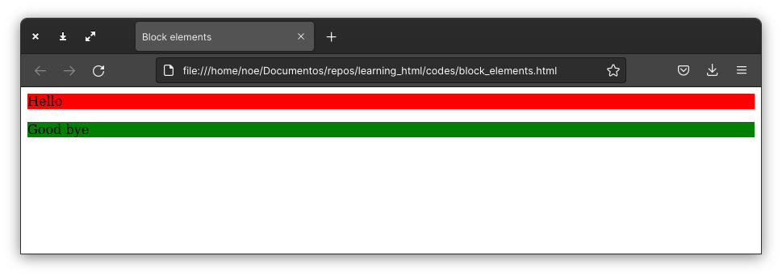

> In the example above the `background` color of each element was changed to see their shape.

As you can see, `block` elements stretches 100% wide, start a new line and stacks vertically.

## In-line elements

Inline elements takes width as per requirement and do not start/end with a new line.

Example:

```html
<!DOCTYPE html>
<html lang="en">
  <head>
    <meta charset="UTF-8" />
    <title>Block elements</title>
  </head>
  <body>
    <div style="background: red">Hello <b>world</b> how are you</div>

    <div style="background: green">
      Hello <b style="background: blue">world</b> how are you
    </div>
  </body>
</html>
```

> See example above at [codes/inline_elements.html](./codes/inline_elements.html)

This is how it looks in the browser:

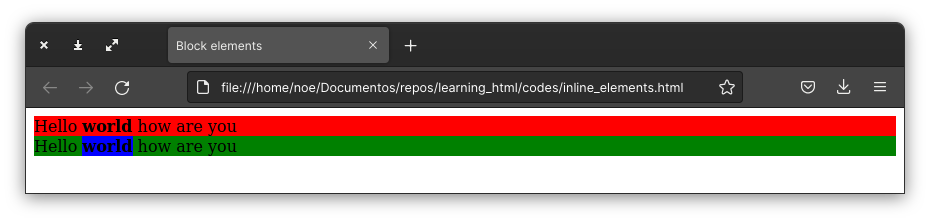

As you can see the `b` element specifies bold text, this element is an inline-block element, you can see in the green div how its box only takes the required width and it do not start or end with a new line.

> Also note that we are inserting an inline-block element inside a block element, this means that a block element can hold both inline-block and block elements.

Here is a list of other inline-block elements:

- a
- img
- input
- code
- label
- span
- small
- br

## Bookmarks

Bookmarks allows the user to jump into specific parts of a web page.

```html
<!DOCTYPE html>
<html lang="en">
  <head>
    <meta charset="UTF-8" />
    <title>Bookmarks</title>
  </head>
  <body>
    <h1>Index</h1>
    <a href="#section_1">Section1</a>
    <a href="#section_2">Section2</a>
    <a href="#section_3">Section3</a>
    <hr />

    <a name="section_1">Section 1</a>
    <div style="width: 200px">
      Lorem ipsum dolor sit amet consectetur adipisicing elit. Voluptates odio
      minus reiciendis ipsum, vel eligendi nihil corporis doloribus in fuga.
      Iure tempore minima laudantium labore accusamus dicta id, maiores nemo.
    </div>

    <br />
    <a name="section_2">Section 2</a>
    <div style="width: 200px">
      Lorem ipsum dolor sit amet consectetur adipisicing elit. Voluptates odio
      minus reiciendis ipsum, vel eligendi nihil corporis doloribus in fuga.
      Iure tempore minima laudantium labore accusamus dicta id, maiores nemo.
    </div>

    <br />
    <a name="section_3">Section 3</a>
    <div style="width: 200px">
      Lorem ipsum dolor sit amet consectetur adipisicing elit. Voluptates odio
      minus reiciendis ipsum, vel eligendi nihil corporis doloribus in fuga.
      Iure tempore minima laudantium labore accusamus dicta id, maiores nemo.
    </div>
  </body>
</html>
```
> See example above at [codes/bookmarks.html](./codes/bookmarks.html)

This is how it looks in the browser:

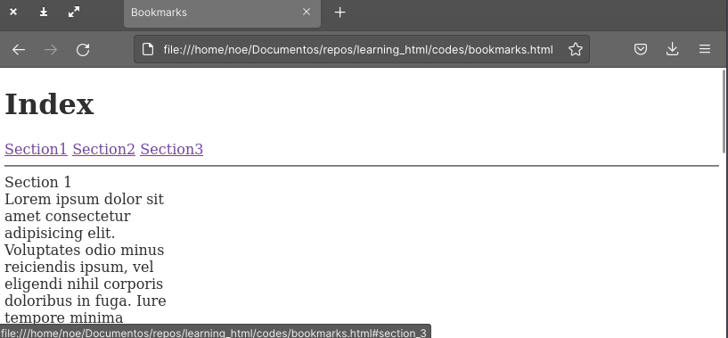

> In the screenshot above the pointer was over link Section_3, note the link at the bottom of the page `file:///home/noe/Documentos/repos/learning_html/codes/bookmarks.html#section_3`

In this example we are creating `a` elements which `href` is `#`+`<name of the element>`

***IMPORTANT***: If you want to use a different element for each section then you need to use the attribute `id` instead of `name`:

```html
<!DOCTYPE html>
<html lang="en">
  <head>
    <meta charset="UTF-8" />
    <title>Bookmarks</title>
  </head>
  <body>
    <h1>Index</h1>
    <a href="#section_1">Section1</a>
    <a href="#section_2">Section2</a>
    <a href="#section_3">Section3</a>
    <hr />

    <div id="section_1">Section 1</div>
    <div style="width: 200px">
      Lorem ipsum dolor sit amet consectetur adipisicing elit. Voluptates odio
      minus reiciendis ipsum, vel eligendi nihil corporis doloribus in fuga.
      Iure tempore minima laudantium labore accusamus dicta id, maiores nemo.
    </div>

    <br />
    <div id="section_2">Section 2</div>
    <div style="width: 200px">
      Lorem ipsum dolor sit amet consectetur adipisicing elit. Voluptates odio
      minus reiciendis ipsum, vel eligendi nihil corporis doloribus in fuga.
      Iure tempore minima laudantium labore accusamus dicta id, maiores nemo.
    </div>

    <br />
    <diva id="section_3">Section 3</div>
    <div style="width: 200px">
      Lorem ipsum dolor sit amet consectetur adipisicing elit. Voluptates odio
      minus reiciendis ipsum, vel eligendi nihil corporis doloribus in fuga.
      Iure tempore minima laudantium labore accusamus dicta id, maiores nemo.
    </div>
  </body>
</html>
```

> See example above at [codes/bookmarks2.html](./codes/bookmarks2.html)

## Comments

Comments are a way to insert text in our HTML documents for our own reference, the browser will ignore comments at all and they will not be rendered, they are useful just for us.

Syntax:

```html
<!-- your comment goes here -->
```

Example:

```html
<!DOCTYPE html>
<html lang="en">
  <head>
    <meta charset="UTF-8" />
    <title>Comments</title>
  </head>
  <body>
    <!-- Add a comment here, maybe say something important -->
    <h1>Title</h1>
    <!-- Example: h1 elements are for headings -->
  </body>
</html>
```

You can also use comments to "disable" a line of HTML, maybe you want to test how your page looks without it but do not want to delete the line, or maybe you are resolving a bug and you may want to see how the page behaves without a line.

> For CSS the `/* comment here */` comment syntax is used for both single and multiline comments. There is no other way to specify comments in CSS.

## HTML Formatting

HTML provides the ability to format text without using CSS (Cascading Style Sheet).

HTML has several tags that you can use to format the text.

### Categories

- **Physical tags**: Provide a visual appearance to the text.
- **Logical tags**: Add logical or semantic value to the text.

Here are some common tags:

- `<b>`: Bold text without any extra importance.
- `<strong>`: Important text with strong importance. The content is displayed in bold.
- `<i>`: Italic text. Often used to indicate a technical term, a phrase from another language, a thought, a ship name, etc.
- `<em>`: Emphasized text. The content inside is typically displayed in italic. A screen reader will pronounce the words in with an emphasis, using verbal stress.
- `<mark>`: Marked or highlighted text
- `<small>`: Smaller text like copyright and other side-comments.
- `<del>`: Deleted text. Browsers will usually strike a line through deleted text
- `<ul>`: Underlined text.
- `<ins>`: Defines a text that has been inserted into a document. Browsers will usually underline inserted text.
- `<sub>`: Subscript text appears half a character below the normal line, and is sometimes rendered in a smaller font
- `<sup>`: Superscript text appears half a character above the normal line, and is sometimes rendered in a smaller font.

Example:

```html
<!DOCTYPE html>
<html>
    <head>
        <meta charset="UTF-8">
        <title>formatting</title>
    </head>
    <body>
        <div>
            <b>sample text using b tag</b>
        </div>
        <div>
            <strong>sample text using strong tag</strong>
        </div>
        <div>
            <i>sample text using i tag</i>
        </div>
        <div>
            <em>sample text using em tag</em>
        </div>
        <div>
            <mark>sample text using mark tag</mark>
        </div>
        <div>
            sample text using <small>small</small> tag
        </div>
        <div>
            <del>sample text using del tag</del>
        </div>
        <div>
            sample text using <u>u tag</u>
        </div>
        <div>
            sample text using <ins>ins</ins> tag
        </div>
        <div>
            sample text using sub tag: H<sub>2</sub>0
        </div>
        <div>
            sample text using sup tag: 2E<sup>6</sup>
        </div>
    </body>
</html>
```

> See example above at [codes/bookmarks.html](./codes/formatting.html)

This is how it looks in the browser:

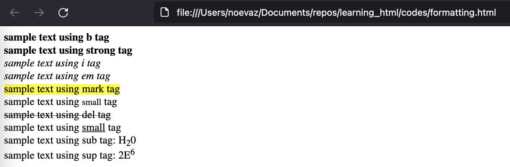

## Quotation tags

- `<blockquote>`: Used to define a block of text which is quoted from another source.
- `q`: used to insert short or inline quotes.

Example

```html
<!DOCTYPE html>
<html lang="en">
<head>
    <meta charset="UTF-8">
    <title>Quotation</title>
</head>
<body>
    <h2>Here is an amazing quote:</h2>
    <blockquote cite="https://www.goodreads.com/quotes">
        <p>You only live once, but if you do it right, once is enough.</p>
        <p><i>Mae West</i></p>
    </blockquote>
    
    <h2>Here is a popular phrase</h2>
    <p><q>Easy come, easy go</q>, This phrase is also in the song bohemian rhapsody.</p>
</body>
</html>
```

> See example above at [codes/quotation.html](./codes/quotation.html)

This is how it looks in the browser:

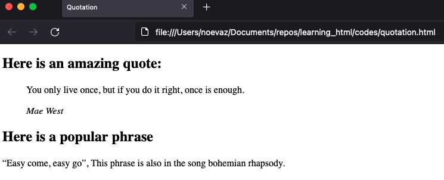

Notes:

- The `cite` attribute specifies the source of a quotation. It's a good habit to always add the source of a quotation, if any. The cite attribute does not render as anything special in any of the major browsers, but it can be used by search engines to get more information about the quotation.

### Abbr tag

`abbr` tag is used for acronyms or abbreviations. The content of this tag renders with dotted underline in some browser.

You can use the `title` attribute to show the full name when hovers over the content.

Example:

```html
<!DOCTYPE html>
<html lang="en">
  <head>
    <meta charset="UTF-8" />
    <title>abbr</title>
  </head>
  <body>
    <abbr title="HyperText Markup Language">HTML</abbr>
  </body>
</html>
```

> See example above at [codes/abbr.html](./codes/abbr.html)

This is how it looks in the browser:

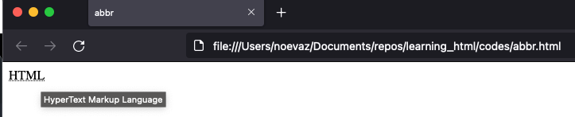

### Address tag

Defines contact information for the author/owner.

Example:

```html
<!DOCTYPE html>
<html lang="en">
  <head>
    <meta charset="UTF-8" />
    <title>Document</title>
  </head>
  <body>
    <address>
      Written by Noe Vaz <br />
      noevaz.com <br />
      Mexico City <br />
    </address>
  </body>
</html>
```

> See example above at [codes/address.html](./codes/address.html)

This is how it looks in the browser:

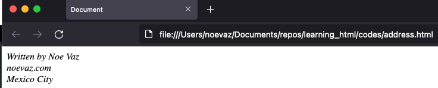

### Cite tag

Defines the title of a creative work, e.g. a book a poem, a song, a movie, a painting, a sculpture.

The content of this tag is usually rendered in itallic.

Example:

```html
<!DOCTYPE html>
<html lang="en">
  <head>
    <meta charset="UTF-8" />
    <title>cite</title>
  </head>
  <body>
    <h2>Here is a popular phrase</h2>
    <p>
      <q>Easy come, easy go</q>, This phrase is also in the song
      <cite>bohemian rhapsody</cite>.
    </p>
  </body>
</html>
```

> See example above at [codes/cite.html](./codes/cite.html)

This is how it looks in the browser:

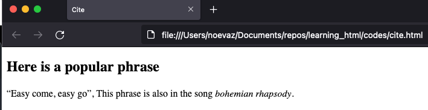

### bdo tag

`bdo` stands for bi-directional override. It is used to override the current text direction.

Use the `dir` attribute to set the direction, options:

- `rtl`: right to left.
- `ltr`: left to right.

Example:

```html
<!DOCTYPE html>
<html lang="en">
<head>
    <meta charset="UTF-8">
    <title>BDO</title>
</head>
<body>
    <p>What is the Pythagorean theorem in simple terms?</p>
    <p>Answer: <bdo dir="rtl">the sum of the squares on the legs of a right triangle is equal to the square on the hypotenuse</bdo></p>
</body>
</html>
```

> See example above at [codes/bdo.html](./codes/bdo.html)

This is how it looks in the browser:


## More about colors

Some attributes recieve a color as the value, there are a variety of way to specify colors with RGB, HEX, HSL, RGBA or HSLA values.

Example:

```html
<!DOCTYPE html>
<html lang="en">
  <head>
    <meta charset="UTF-8" />
    <title>colors</title>
  </head>
  <body>
    <h1 style="color: tomato;
    border: 8px solid royalblue;
    text-align: center">
      Hello Tomato world
    </h1>
  </body>
</html>
```

> See example above at [codes/colors.html](./codes/colors.html)

This is how it looks in the browser:

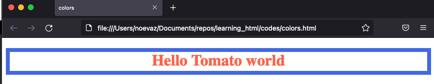

> The `border` attribute recieves tree values `value style color`.

### RGB colors

Example:

```html
color: rgb(255, 0, 0)
```

### RGBA colors

`RGBA` is an extension of RGB color values with an Alpha channel, this channel represents the opacity for a color.

An alpha parameter is a number between 0.0 (fully transparent) and 1.0 (fully opaque)

Example:

```html
color: rgba(255, 0, 0, 0.5)
```

### HEX colors

Specified with #RRGGBB

> `FF` hex to dec is 255

## Image float

As any other element, `img` can have multiple attributes, e.g. `src`, `alt`, `width`, `height`, etc.

Another useful **style** attribute is `float`, it lets the image float to the right or to the left of text (rememeber that images are inline-block elements).

Example:

```html
<!DOCTYPE html>
<html lang="en">
  <head>
    <meta charset="UTF-8" />
    <title>Block elements</title>
  </head>
  <body>
    <div style="background: red">Hello <b>world</b> how are you</div>

    <div style="background: green">
      Hello <b style="background: blue">world</b> how are you
    </div>
  </body>
</html>
```

> See example above at [codes/float.html](./codes/float.html)

This is how it looks in the browser:

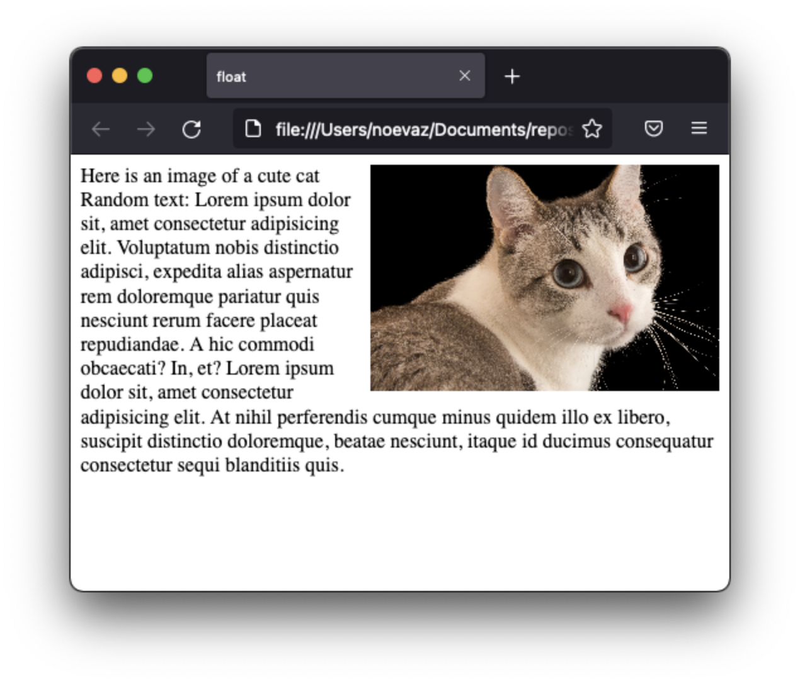

> Learn more about `float` at [https://developer.mozilla.org/en-US/docs/Web/CSS/float](https://developer.mozilla.org/en-US/docs/Web/CSS/float)

**IMPORTANT** (kinda): you can insert `.gif` images not only `.png` images.

## Image maps

Image maps defines an image with clickable areas, the idea is that you should be able to perform actions depending where in the image you click.

Example:

```html
<!DOCTYPE html>
<html lang="en">
  <head>
    <meta charset="UTF-8" />
    <title>image maps</title>
  </head>
  <body>
    
    <map name="workmap">
      <area
        shape="rect"
        coords="0,0, 30, 150"
        href="https://thecatsite.com"
        onclick="alert('meow')"
        title="visit thecatsite.com"
      />
    </map>
  </body>
</html>
```

> See example above at [codes/image_maps1.html](./codes/image_maps1.html)

> `href` and `onclick` attributes are optionals but useful.

> The `onclick` attribute can call a `Javascript` function, this time we are calling the `alert` function with the message `meow`, the alert function pop up a window with the message.

This is how it looks in the browser:

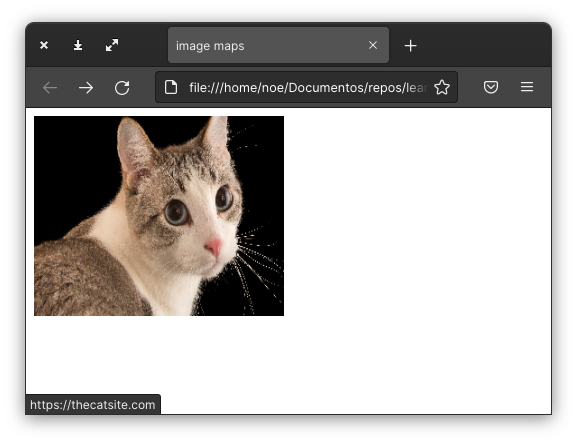

Then if you click in the area:

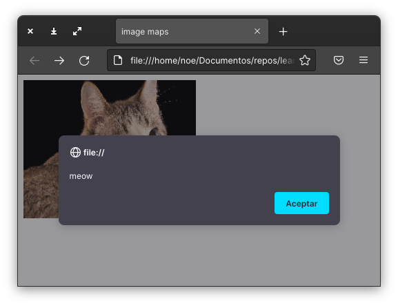

After clicking on accept or esc:


The shape takes one of these values:

- `rect`: defines a rectangle
- `circle`: defines a circle
- `poly`: defines a polygonal figure
- `default`: convers the entire region

`<map>` and `<area>` tags themselves are already transparent, in fact, `<map>` isn't visualized at all; it just defines the hover/click areas for the image/svg element that uses this particular map.

If you want areas to be "colored", you need to recolor the underlying image or use external libraries.

## Background images

Images can be specified for almost any HTML element as the background.

Syntax:

```html
background-image: url(path here)
```

Example:

```html
<!DOCTYPE html>
<html lang="en">
  <head>
    <meta charset="UTF-8" />
    <title>Background Images</title>
  </head>
  <body>
    <p>Let's use the following image as the background-image:</p>
    
    <div style="background-image: url(../media/tile.png); color: white">
      RANDOM TEXT: Lorem ipsum dolor sit amet consectetur adipisicing elit.
      Aliquam optio totam velit, veritatis omnis necessitatibus quae quasi
      inventore vitae magni molestias dolorum minima porro, suscipit dolore
      dicta deserunt? Libero, officiis? Lorem ipsum dolor sit amet consectetur
      adipisicing elit. Fuga autem, labore reprehenderit amet excepturi debitis
      ad? Facere quaerat neque quod? Voluptatum non quis quos quibusdam illum
      blanditiis. Laboriosam, cum at.
    </div>
  </body>
</html>
```

> See example above at [codes/background_images.html](./codes/background_images.html)

This is how it looks in the browser:

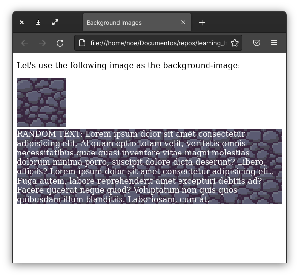

By default the image repeats itself horizontally and vertically. You can change this behavior by setting the `brackground-repeat` style attribute, learn more at [https://developer.mozilla.org/en-US/docs/Web/CSS/background-repeat](https://developer.mozilla.org/en-US/docs/Web/CSS/background-repeat)

## Lists

HTML lists are used to specify lists of information.

There are three different types of lists:

- Ordered lists: These are numbered lists.
- Unordered lists: Each element has a bullet insted of a number.
- Description lists: List of terms with a **description** of each of them.

Example:

```html
<!DOCTYPE html>
<html lang="en">
  <head>
    <meta charset="UTF-8" />
    <title>lists</title>
  </head>
  <body>
    <h2>Ordered lists</h2>
    <ol>
      <li>first</li>
      <li>second</li>
      <li>third</li>
    </ol>

    <h2>Unordered lists</h2>
    <ul>
      <li>sugar</li>
      <li>soda</li>
      <li>coffee</li>
      <li>milk</li>
    </ul>

    <h2>Description lists</h2>
    <dl>
      <dt>Dogs</dt>
      <dd>the bests fiends</dd>
      <dt>Cats</dt>
      <dd>the most agiles</dd>
      <dt>Robots</dt>
      <dd>not the best friends nor agiles, yet</dd>
    </dl>
  </body>
</html>
```

> See example above at [codes/lists.html](./codes/lists.html)

This is how it looks in the browser:

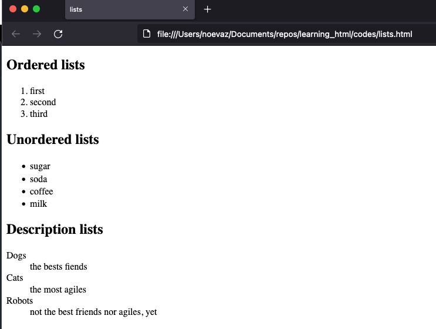

### Nested lists

You can place a lists inse another list.

Example:

```html
<!DOCTYPE html>
<html lang="en">
  <head>
    <meta charset="UTF-8" />
    <title>nested lists</title>
  </head>
  <body>
    <ol>
      <li> <!-- item of ordered list-->
        <p>BOYS</p>
        <ul> <!-- nested unordered list -->
          <li>Noe</li>
          <li>Pedro</li>
          <li>Juan</li>
          <li>Ernesto</li>
        </ul>
      </li>

      <li> <!-- item of ordered list-->
        <p>GIRLS</p>
        <ul> <!-- nested unordered list -->
          <li>Andrea</li>
          <li>Pedrilla</li>
          <li>Juanilla</li>
          <li>Ernestina</li>
        </ul>
      </li>

      <li> <!-- item of ordered list-->
        <p>PETS</p>
        <ul> <!-- nested unordered list -->
          <li>dog</li>
          <li>cat</li>
        </ul>
      </li>
    </ol>
  </body>
</html>
```

> See example above at [codes/nested_lists.html](./codes/nested_lists.html)

This is how it looks in the browser:

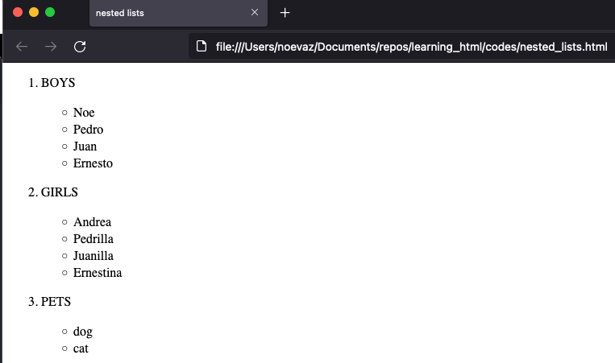

## Picture element

The `picture` element displays different pictures for different devices or screen sizes.

The picture element holds `source` elements which define the image and screen size.

Example:

```html
<!DOCTYPE html>
<html lang="en">
  <head>
    <meta charset="UTF-8" />
    <title>Picture elements</title>
  </head>
  <body>
    <picture>
      <source media="(min-width: 650px)" srcset="../media/space600x300.png" />
      <source media="(min-width: 450px)" srcset="../media/volcano400x200.png" />
      
    </picture>
  </body>
</html>
```

> See example above at [codes/picture_elements.html](./codes/picture_elements.html)

This is how it looks in the browser:


Resizing the window:

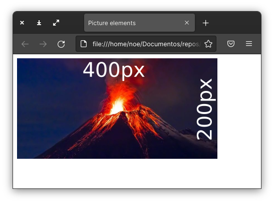

**IMPORTANT**: The `<picture>` element contains one or more `<source>` tags and one `` tag. The `` element is required as the last child of the `<picture>` element, as a fallback option if none of the source tags matches.

## Tables

By default `th` (table header) elements are shown in bold and centered.

`td` (table data) elements have a regular font and are left-aligned.

Example:

```html
<!DOCTYPE html>
<html lang="en">
<head>
    <meta charset="UTF-8">
    <title>Tables</title>
</head>
<body>
    <table>
        <tr>
            <th>Name</th>
            <th>Grade</th>
        </tr>
        <tr>
            <td>Noe</td>
            <td>9.3</td>
        </tr>
        <tr>
            <td>Noelia</td>
            <td>8.5</td>
        </tr>
    </table>
</body>
</html>
```

> See example above at [codes/tables.html](./codes/tables.html)

This is how it looks in the browser:

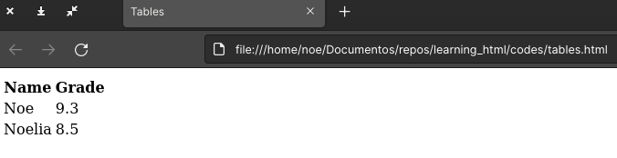

## STYLE element

The `style` element hold CSS code for styling.

CSS adds styles for a given selector. A selector can be an HTML element, its children, or a group of elements.

Using this element inside a HTML file is known as internal or embedded CSS.

Syntax:

```
element {
  attribute1: value;
  attribute2: value;
  attributeN: value;
}

element2 {
  attribute1: value;
  attribute2: value;
  attributeN: value;
}
```

Unless you are very specific, CSS will add the styles to all of the element, e.g. `p{color: red;}` will make ALL `p` elements's font red.

The `style` element is usually place in the `head`.

Example:

```html
<!DOCTYPE html>
<html lang="en">
<head>
    <meta charset="UTF-8">
    <title>Style element</title>
    <style>
        table, th, td {
            border: 1px solid black;
            border-collapse: collapse;
        }
        table {
            width: 400px;
        }
    </style>
</head>
<body>
    <table>
        <tr>
            <th>Name</th>
            <th>Grade</th>
        </tr>
        <tr>
            <td>Noe</td>
            <td>9.3</td>
        </tr>
        <tr>
            <td>Noelia</td>
            <td>8.5</td>
        </tr>
    </table>
</body>
</html>
```

> See example above at [codes/style_element.html](./codes/style_element.html)

This is how it looks in the browser:

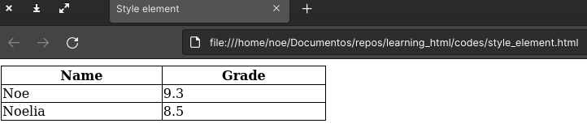

## More about tables

You can "merge" 2 colums by using the `colspan` attribute in a `td` or `th` element, example: `<td colspan="2">content</td>`.

In the other hand, if you want a cell span more that one row, use the `rowspan` attribute.

Example:

```html
<!DOCTYPE html>
<html lang="en">
<head>
    <meta charset="UTF-8">
    <title>table span</title>
    <style>
        table, th, td {
            border: 1px solid black;
            border-collapse: collapse;
        }
        table {
            width: 400px;
        }
    </style>
</head>
<body>
    <table>
        <tr>
            <th>Name</th>
            <th colspan="2">Grades</th>
        </tr>
        <tr>
            <td>Noe</td>
            <td>9.3</td>
            <td>8.9</td>
        </tr>
        <tr>
            <td>Noelia</td>
            <td>8.5</td>
            <td rowspan="2">10</td>
        </tr>
        <tr>
            <td>Pedro</td>
            <td>7.3</td>
        </tr>
    </table>
</body>
</html>
```

> See example above at [codes/table_span.html](./codes/table_span.html)

This is how it looks in the browser:

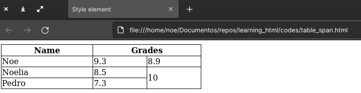

## Class attribute

The 'class' attribute is used to specify a class for an HTML element, multiple HTML elements can share the same class. The class can be used by Javascript or CSS to add styles or behaviour to the elements that have the class.

Example:

```html
<!DOCTYPE html>
<html lang="en">
<head>
    <meta charset="UTF-8">
    <title>class attribute</title>
    <style>
        .my_custom_font {
            color: white;
            font-weight: bold;
            font-family: 'Courier New', Courier, monospace;
        }
        .red_bkg {
            background-color: red;
        }
        .big_font {
            font-size: 30px;
        }
    </style>
</head>
<body>
    <p class="red_bkg my_custom_font">Hello world</p>
    <p class="big_font">Hello world</p>
    <p class="red_bkg big_font">Hello world</p>
</body>
</html>
```

> See example above at [codes/class_attribute.html](./codes/class_attribute.html)

This is how it looks in the browser:


> Note that an element can have multiple classes, then you can add styles to each class, the syntax of the selector was a dot along with the name of the class (dot notation) then add the styles between curly brackets.


## ID attribute

The `id` attribute is used to add a unique id to an HTML element, you cannot have more that one element with the same `id`.

CSS and Js can also use this ID to add styles and behaviours.

Example:

```html
<!DOCTYPE html>
<html lang="en">
  <head>
    <meta charset="UTF-8" />
        <title>id attribute</title>
    <style>
      * {
        background-color: rgb(16, 52, 172);
        padding: 0 auto;
        margin: 0;
        /* The margin property controls the space
        outside an element, and the padding property
        controls the space inside an element.*/
      }
      #heading_1 {
        color: aqua;
        background-color: black;
        font-weight: bolder;
        text-align: center;
        font-family: Verdana, Geneva, Tahoma, sans-serif;
      }
    </style>
  </head>
  <body>
    <h1 id="heading_1">HELLO WORLD</h1>
  </body>
</html>

```

> See example above at [codes/id_attribute.html](./codes/id_attribute.html)

This is how it looks in the browser:

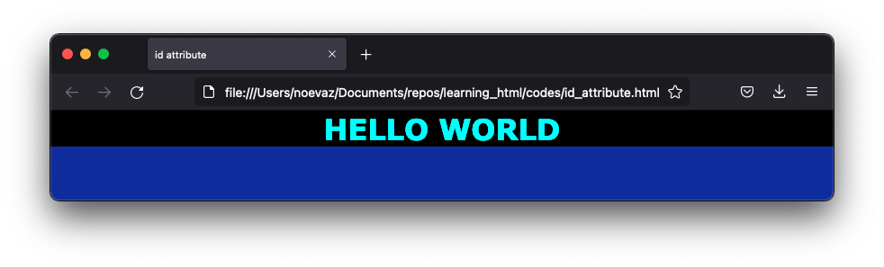

## Iframes

Iframes are used to display a nested webpage.

Example:

```html
<!DOCTYPE html>
<html lang="en">
  <head>
    <meta charset="UTF-8" />
    <meta name="viewport" content="width=device-width, initial-scale=1.0" />
    <title>Iframes</title>
  </head>
  <body>
    <h1>iframe</h1>

    <iframe
      name="mycuteiframe"
      src="https://en.wikipedia.org/wiki/HTML"
      width="750"
      height="300"
    ></iframe>
    
    <!-- You can open a different page using an "a" tag that points to the iframe name, see next line: -->
    <p><a href="./colors.html" target="mycuteiframe">open colors.html</a></p>
  </body>
</html>
```
> `name`, `width`, and `height` are optional attributes but useful.

> See example above at [codes/iframes.html](./codes/iframes.html)

This is how it looks in the browser:

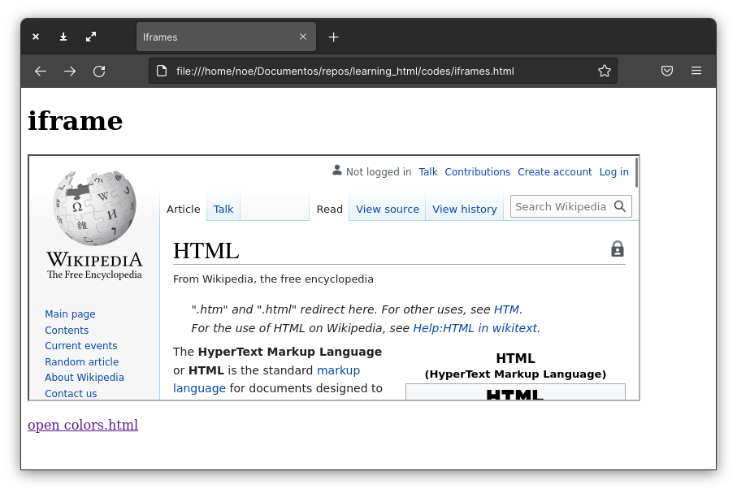

And when you click in the link:

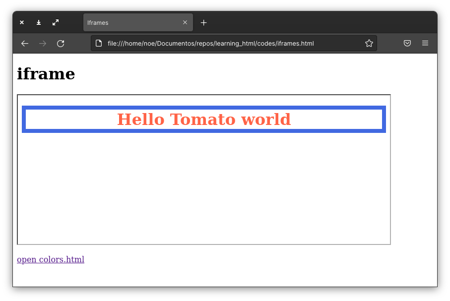

If you are curious about how the browser handle this, check the inspector in the browser, here you can see that in fact the iframe contains another document:

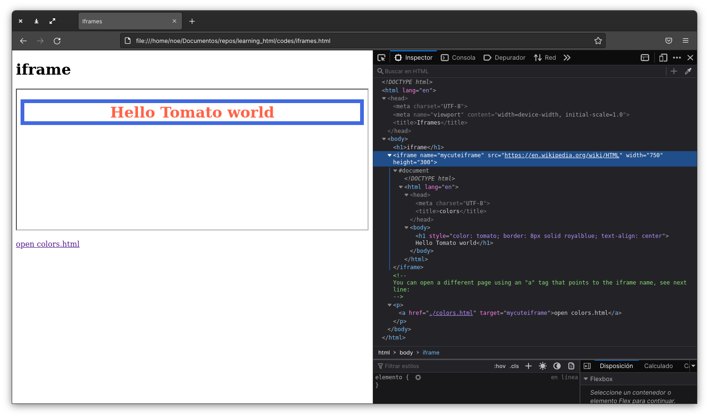


## Universal selector

The asterisk (`*`) is known as the CSS universal selectors. It can be used to select any and all types of elements in an HTML page. 

```html
* {
  background-color: rgb(16, 52, 172);
  padding: 0 auto;
  margin: 0;
}
```

> This is a fragment from [codes/id_attribute.html](./codes/id_attribute.html)

> In CSS, a `margin` is the space around an element’s border, while `padding` is the space between an element’s border and the element’s content.

## HTML with JAVASCRIPT

You can use Js to add behaviours to a web page. Javascript can be embedded in HTML using the `<script>` element, just as the `<style>` element for CSS. Js can be also be linked as an external resource: `<script src="path/to/file.js"></script>` (**when using the src attribute the content of the script element is ignored because the file is loaded instead**).

Example:

```html
<!DOCTYPE html>
<html lang="en">
<head>
    <meta charset="UTF-8">
    <title>html with js</title>
</head>
<body>
    <p id="myparagraph">Hello</p>
    <script>
        let p = document.getElementById("myparagraph");
        p.innerHTML = "I changed the text :)"
    </script>
</body>
</html>
```

> See example above at [codes/html_with_js.html](./codes/html_with_js.html)

This is how it looks in the browser:

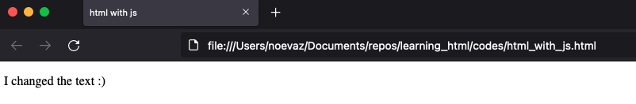

In this example the Js code stores the reference of the element whose id is `myparagraph` in the `p` variable, then it use the `innerHTML` attribute to sets the HTML content of the element.

JS code is automatically loaded and executed that's why you immediately see the text changed.

> This is a HTML tutorial so do not worry to much for Js, not yet.

## Responsive Web Design

RWD is about creating we pages that look good on all devices. Adjust for different screen sizes and viewports.

Here are a few things you need to start doing if you want your page to be responsive:

- Add a `meta` tag to let the browser know how it will control the page's dimensions and scalling. Syntax: `<meta name="viewport" content="width=device-width",s initial-scale=1.0>`
- Responsive images: you can set the width of an image to 100%, this means the width will be the same as the full length of the width, it doesn't matter how much is it, the image browser will calculate that for us, syntax: ``. You can also use the `max-width` style property, this property scales the image down if required but it never scales up to be larger that the max width specified, syntax: `` (50% is just a random value to explain the syntax).
- Add **media queries**: this are a way to add different styles to elements for different browser sizes. Here is an example:

```html
<!DOCTYPE html>
<html lang="en">
<head>
    <meta charset="UTF-8">
    <meta name="viewport" content="width=device-width, initial-scale=1.0">
    <title>media queries</title>
    <style>
        body {
                background-color: red;
        }
        @media only screen and (max-width: 600px) {
            body {
                background-color: green;
            }
        }
        @media only screen and (max-width: 500px) {
            body {
                background-color: blue;
            }
        }
    </style>
</head>
<body>
    
</body>
</html>
```

> See example above at [codes/media_queries.html](./codes/media_queries.html)

This is how it looks in the browser:

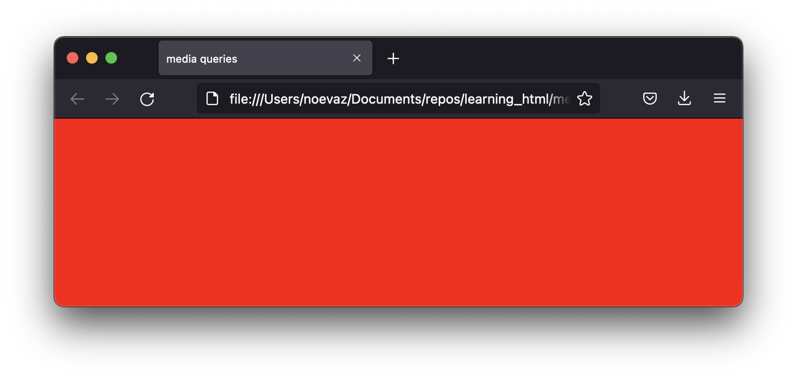

Scaling down the window:

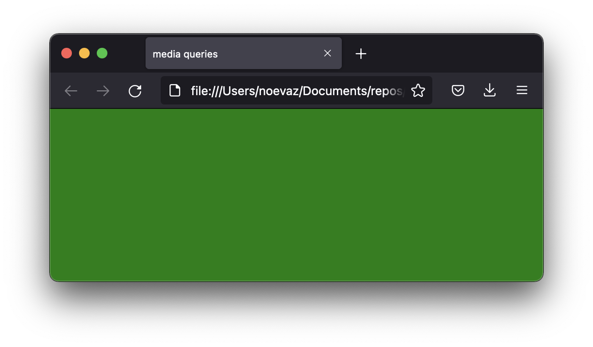

Scaling down one more time:

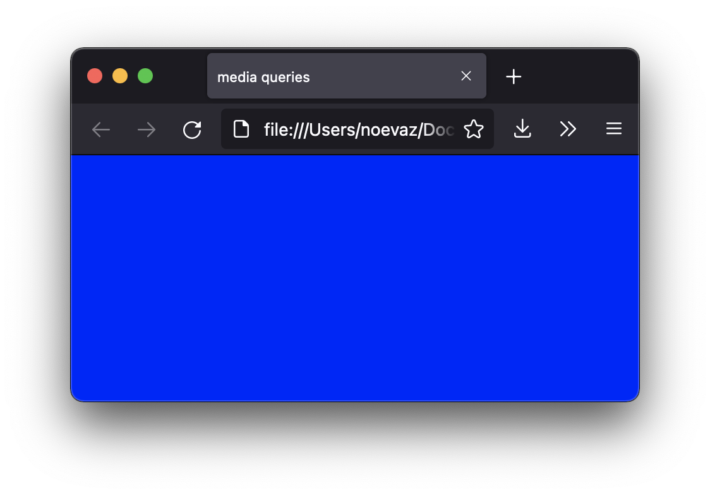
<<<<<<< HEAD

## Layout elements

Layout provides a way to arrange web pages in well-mannered, well-structured, and in responsive form.

HTML has several semantic elements that defines the parts of a web page:

- `<header>`: used to created the header section of web pages.
- `<nav>`: container for the main block of navigation links.
- `<section>`: represent a separate section of a web page.
- `<article>`
- `<aside>`
- `<footer>`: defines the footer for the web page.
- `<summary>`> used with the `<details>` element. It holds camptions about the content of `<details>` element.


Example:

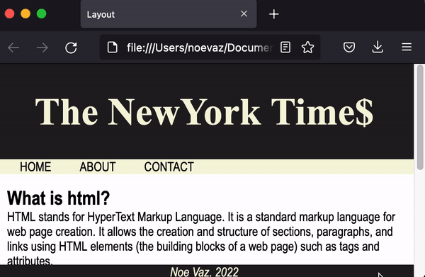

> See the code of example above at [codes/layout.html](./codes/layout.html)


=======
>>>>>>> 8757814243dc929b3e793b903a2c4f9df427d966
