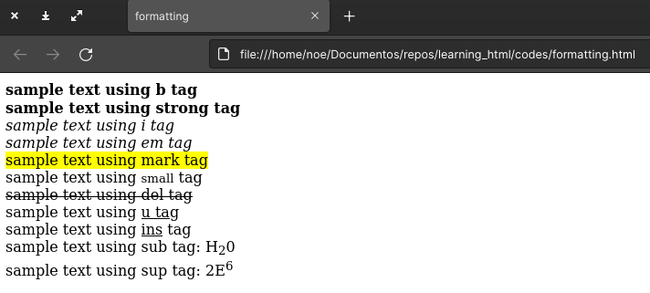
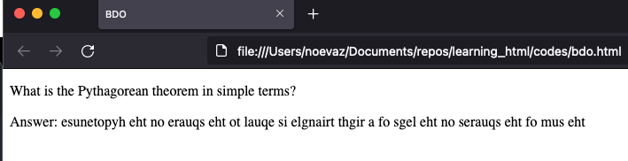

# HTML

The Hypertext Markup Language defines the **structure** of a web page.
It enclose the contents of the page inside **elements** which have a significant meaning for the browser.


> HTML is not a programming language, it is a Markup language.

## Elements and Tags

Elements are enclose content between **tags**.

Tags are the starting and ending parts of an element.

For example the **p** element defines a paragraph. The starting tag for this element is `<p>` and the ending tag is `</p>`.

Then you can put content between this tags:

```html
<p>Hello this is a paragraph</p>
```

> See example above at [codes/paragraph.html](./codes/paragraph.html)

As you can see ending tags are almost equals to the starting tag, the only difference is that ending tags have a forward slash `/`.

## Attributes

Elements can have attributes that give a bit extra info to the browser.

Example, the `a` tag is used to create a link:

```html
<a href="https://www.google.com/">click to go google</a>
```

> See example above at [codes/anchor.html](./codes/anchor.html)

> Attributes must be in the starting tag, **never** in the ending tag.

As you can see, the `href` (hyper reference) attribute is used in `a` elements to provide the link we want to use. Note that the value of the attribute is enclosed between quotes, you can also use simple quotes but do not mix both.

There are some attributes that are common in the majority of elements, and other attributes that are reserved for specific elements, you will learn more attributes and elements later on this course.

## Unclosed tags

Jus a few elements does not need and ending tag. You will learn some of them throughout this course.

Unclosed tags does not have content that's why an ending tag is not needed.

> Unclosed tags are also known as  self closing tags, void tags, empty tags, singletons tags.

Examples are:

- `` for images
- `<br />` to insert a single line break
- `<hr />` to add a horizontal rule

> `br`and `hr`are example of empty tags because you rarely will add an attributes to them, you just use them as they are.

> Also note there is an space between the tag and the slash, older web browsers will have issues to understand this, therefore try to add that space.

Although you can use a slash ath the end of the tag `/>` this is not mandatory and does not give any special meaning to the browser.

The browser will remove the slashes and then render the elements:


> You can see the code of the image at [codes/unclosed_tags.html](./codes/unclosed_tags.html)

HOWEVER, for XHTML (a similar language but more strict) it is required to add that slash in unclosed tags. ALSO some frameworks like **react** will trow an error if these are not closed.

📌 **Good practice**: ALWAYS "close" an unclosed tag by adding a slash at the end.

## DOCTYPE declaration

The `Doctype` declaration is an "information" to the browser about the HTML version. We can also refer to the Doctype as the **Document Type Declaration** (DTD)  

**It is NOT a tag**

that is used to specify the HTML version.

It must appear at the beginning of an HTML file. For HTML5 the syntax is a follows:

```html
<!DOCTYPE html>
```

> The Doctype declaration is NOT case sensitive, so it is not mandatory to use all letters is upper case.

## HTML tag

The `HTML` represents the root of an HTML document. It is a container for all other elements, except for the DOCTYPE.

Example:

```html
<!DOCTYPE html>
<html>
</html>
```

## Head tag

The `head` tag is used to group information about the document, e.g. title, character encoding, icon of the tab, useful metadata, etc.

Example:

```html
<!DOCTYPE html>
<html>
    <head>
    </head>
</html>
```

Let's add some elements to the `head`:

```html
<!DOCTYPE html>
<html>
    <head>
        <title>My page</title>
        <meta charset="UTF-8">
    </head>
    <p>I am not inside the head tag. México.</p>
</html>
```

> See example above at [codes/head_tag.html](./codes/head_tag.html)

This is how it looks in the browser:


- Note the name of the tab, that was caused by the `title` tag. This tag is important for Search Engine Optimization (SEO).
- Note the `é` in `México`, we were able to see that symbol because we use `<meta charset="UTF-8">`, the `meta` tag defines metadata, in can have multiple attributes, this time we use `charset` to set the character encoding to `UTF-8` so we can see the letter `é`.

## Body tag

The `body` tag defines the document's body, it contains all the HTML elements e.g. paragraphs, links, images, tables, etc.

> Note: Only use the `body` element once in your document.

Example:

```html
<!DOCTYPE html>
<html>
    <head>
        <title>My page</title>
        <meta charset="UTF-8">
    </head>
    <body>
        <h1>This is my page<h2>
        <p>I am not inside the head tag. México.</p>
        <h2>Hello World</h2>
    </body>
</html>
```

> See example above at [codes/body_tag.html](./codes/body_tag.html)

This is how it looks in the browser:


- The `h1` tag is used to add a heading, there are 6 levels for headings: `h1`, `h2`, `h3`, `h4`, `h5`, and `h6`, each heading represents the level of importance, being `h1` the most important heading. This is important for SEO.

## More about links

We already se the `a` element is used to redirect a user when the link is clicked.

This element can have a few attributes:

- `href`: (optional, but makes no sense to use the `a` element if you are not going to redirect at all) The link where we want to redirect the user.
- `title`: (optional) an small message the user will se when hovering the pointer over the link.
- `target`: (optional) specifies where to open the link, options (Do not worry if you do nto understand all the options yet):
    - `_blank`: Opens the linked document in a new window or tab
    - `_self`: Opens the linked document in the same frame as it was clicked (this is default)
    - `_parent`: Opens the linked document in the parent frame
    - `_top`: Opens the linked document in the full body of the window
    - `framename`: Opens the linked document in the named iframe

Example:

```html
<!DOCTYPE html>
<html>
  <head> </head>
  <body>
    <a
      href="https://www.facebook.com/"
      title="click here to open facebook"
      target="_blank"
      >Go to facebook</a
    >
  </body>
</html>
```

> See example above at [codes/more_about_anchor.html](./codes/more_about_anchor.html)

This is how it looks in the browser:


> The cursor is not shown in the screenshot but the message was shown when the user hover pointer over the link.

Do you want to create an image that links to another site?, then use an `img` element as the content of an `a` element:

```html
<!DOCTYPE html>
<html>
  <head>
    <title>image link</title>
  </head>
  <body>
    <a
      href="https://www.facebook.com/"
      title="click here to open facebook"
      target="_blank"
    >
      
    </a>
  </body>
</html>
```

> See example above at [codes/image_link.html](./codes/image_link.html)

This is how it looks in the browser:


## More about images

We already saw that `img` element is used to add an image to the document.

These are some common attributes:

- `src`: Link to the image. If your image is local you can specify the path to the image e.g. ``
- `alt`: An alternative name in case the `src` was not a valid address/link/path, also this value is used if the user is using a screen reader.
- `title`: title that will appear when the user hovers the pointer over the image.
- `width`: width of the image in pixels, example `width="200"` (this will be 200 pixels).
- `height`: height of the image in pixels, example `height="300"` (this will be 300 pixels).

Example:

```html
<!DOCTYPE html>
<html lang="en">
  <head>
    <meta charset="UTF-8" />
    <meta http-equiv="X-UA-Compatible" content="IE=edge" />
    <meta name="viewport" content="width=device-width, initial-scale=1.0" />
    <title>Document</title>
  </head>
  <body>
    
  </body>
</html>
```

> See example above at [codes/more_about_anchor.html](./codes/images.html)

This is how it looks in the browser:


## Style attribute

The `style` attribute is used to add styles to HTML elements, that can be color, font, size, etc.

The `style`attribute is also know as **inline CSS**, because you are modifying the styles of the element in the element itself.

Example:

```html
<!DOCTYPE html>
<html lang="en">
  <head>
    <meta charset="UTF-8" />
    <title>style attribute</title>
  </head>
  <body>
    
    <p style="color: red">Hey look I'm red</p>
    <p style="color: #f00">Hey look I'm also red</p>
    <p style="font-family: 'Courier', 'Lucida Sans'; color: blue">
      I have a different font
    </p>
    <p style="font-size: 50px">I am big</p>
  </body>
</html>
```

> See example above at [codes/style_attribute.html](./codes/style_attribute.html)

This is how it looks in the browser:


Notes:
- For `width` and `height` **styles** you need to provide the measurement `px` unlike the `width` and `height` **attributes** which are always in pixels.
- You can add multiple styles by separating each style using a semicolon `;`.
- A single style can have multiple values, as the `font-family`in this case you can separate each value using a comma `,`.
- The `font-family` style will use the first font listed, if it is not available it will try with the next and will continue to do that until one font is found for use.
- The `color` property receives a hexadecimal value (#F00 is the same as red because the first hex value is R (red), the second digit is G (green) and the last value is B (blue)) or a common color name such as red or blue, read more at [https://htmlcolorcodes.com/color-names/](https://htmlcolorcodes.com/color-names/)

Here are another common styles you can apply:

- `font-size`: Font size, the value is a number along with the measure (px for pixels), the number and the measure should be together without spaces between them.
- `text-align`: specifies the horizontal alignment, options: `left`, `right`, ``center

## Display property values

All display elements (elements that are rendered in the user interface) have a default behavior to be shown in the browser.

The display property (`style="display: <VALUE HERE>"`) specifies how and element takes place in the view.

Every element is treated as a box, the display property specifies how this box will be shown.

The most common values for the `display`property are:

- block
- inline-block
- table
- flex
- grid
- none

### Block-level elements

Some elements use `block` as the default value for the `display` property, e.g. `h1`to `h6`, `p`, `div`, etc.

The `div` element is a generic container, you can use it for any generic text.

It is a `block` element just as the `p` element.

Example:

```html
<!DOCTYPE html>
<html lang="en">
  <head>
    <meta charset="UTF-8" />
    <title>Block elements</title>
  </head>
  <body>
    <div style="background: red">Hello</div>
    <p style="background: green">Good bye</p>
  </body>
</html>
```

> See example above at [codes/block_elements.html](./codes/block_elements.html)

This is how it looks in the browser:


> In the example above the `background` color of each element was changed to see their shape.

As you can see, `block` elements stretches 100% wide, start a new line and stacks vertically.

## In-line elements

Inline elements takes width as per requirement and do not start/end with a new line.

Example:

```html
<!DOCTYPE html>
<html lang="en">
  <head>
    <meta charset="UTF-8" />
    <title>Block elements</title>
  </head>
  <body>
    <div style="background: red">Hello <b>world</b> how are you</div>

    <div style="background: green">
      Hello <b style="background: blue">world</b> how are you
    </div>
  </body>
</html>
```

> See example above at [codes/inline_elements.html](./codes/inline_elements.html)

This is how it looks in the browser:


As you can see the `b` element specifies bold text, this element is an inline-block element, you can see in the green div how its box only takes the required width and it do not start or end with a new line.

> Also note that we are inserting an inline-block element inside a block element, this means that a block element can hold both inline-block and block elements.

Here is a list of other inline-block elements:

- a
- img
- input
- code
- label
- span
- small
- br

## Bookmarks

Bookmarks allows the user to jump into specific parts of a web page.

```html
<!DOCTYPE html>
<html lang="en">
  <head>
    <meta charset="UTF-8" />
    <title>Bookmarks</title>
  </head>
  <body>
    <h1>Index</h1>
    <a href="#section_1">Section1</a>
    <a href="#section_2">Section2</a>
    <a href="#section_3">Section3</a>
    <hr />

    <a name="section_1">Section 1</a>
    <div style="width: 200px">
      Lorem ipsum dolor sit amet consectetur adipisicing elit. Voluptates odio
      minus reiciendis ipsum, vel eligendi nihil corporis doloribus in fuga.
      Iure tempore minima laudantium labore accusamus dicta id, maiores nemo.
    </div>

    <br />
    <a name="section_2">Section 2</a>
    <div style="width: 200px">
      Lorem ipsum dolor sit amet consectetur adipisicing elit. Voluptates odio
      minus reiciendis ipsum, vel eligendi nihil corporis doloribus in fuga.
      Iure tempore minima laudantium labore accusamus dicta id, maiores nemo.
    </div>

    <br />
    <a name="section_3">Section 3</a>
    <div style="width: 200px">
      Lorem ipsum dolor sit amet consectetur adipisicing elit. Voluptates odio
      minus reiciendis ipsum, vel eligendi nihil corporis doloribus in fuga.
      Iure tempore minima laudantium labore accusamus dicta id, maiores nemo.
    </div>
  </body>
</html>
```
> See example above at [codes/bookmarks.html](./codes/bookmarks.html)

This is how it looks in the browser:


> In the screenshot above the pointer was over link Section_3, note the link at the bottom of the page `file:///home/noe/Documentos/repos/learning_html/codes/bookmarks.html#section_3`

In this example we are creating `a` elements which `href` is `#`+`<name of the element>`

***IMPORTANT***: If you want to use a different element for each section then you need to use the attribute `id` instead of `name`:

```html
<!DOCTYPE html>
<html lang="en">
  <head>
    <meta charset="UTF-8" />
    <title>Bookmarks</title>
  </head>
  <body>
    <h1>Index</h1>
    <a href="#section_1">Section1</a>
    <a href="#section_2">Section2</a>
    <a href="#section_3">Section3</a>
    <hr />

    <div id="section_1">Section 1</div>
    <div style="width: 200px">
      Lorem ipsum dolor sit amet consectetur adipisicing elit. Voluptates odio
      minus reiciendis ipsum, vel eligendi nihil corporis doloribus in fuga.
      Iure tempore minima laudantium labore accusamus dicta id, maiores nemo.
    </div>

    <br />
    <div id="section_2">Section 2</div>
    <div style="width: 200px">
      Lorem ipsum dolor sit amet consectetur adipisicing elit. Voluptates odio
      minus reiciendis ipsum, vel eligendi nihil corporis doloribus in fuga.
      Iure tempore minima laudantium labore accusamus dicta id, maiores nemo.
    </div>

    <br />
    <diva id="section_3">Section 3</div>
    <div style="width: 200px">
      Lorem ipsum dolor sit amet consectetur adipisicing elit. Voluptates odio
      minus reiciendis ipsum, vel eligendi nihil corporis doloribus in fuga.
      Iure tempore minima laudantium labore accusamus dicta id, maiores nemo.
    </div>
  </body>
</html>
```

> See example above at [codes/bookmarks2.html](./codes/bookmarks2.html)

## Comments

Comments are a way to insert text in our HTML documents for our own reference, the browser will ignore comments at all and they will not be rendered, they are useful just for us.

Syntax:

```html
<!-- your comment goes here -->
```

Example:

```html
<!DOCTYPE html>
<html lang="en">
  <head>
    <meta charset="UTF-8" />
    <title>Comments</title>
  </head>
  <body>
    <!-- Add a comment here, maybe say something important -->
    <h1>Title</h1>
    <!-- Example: h1 elements are for headings -->
  </body>
</html>
```

## HTML Formatting

HTML provides the ability to format text without using CSS (Cascading Style Sheet).

HTML has several tags that you can use to format the text.

### Categories

- **Physical tags**: Provide a visual appearance to the text.
- **Logical tags**: Add logical or semantic value to the text.

Here are some common tags:

- `<b>`: Bold text without any extra importance.
- `<strong>`: Important text with strong importance. The content is displayed in bold.
- `<i>`: Italic text. Often used to indicate a technical term, a phrase from another language, a thought, a ship name, etc.
- `<em>`: Emphasized text. The content inside is typically displayed in italic. A screen reader will pronounce the words in with an emphasis, using verbal stress.
- `<mark>`: Marked or highlighted text
- `<small>`: Smaller text like copyright and other side-comments.
- `<del>`: Deleted text. Browsers will usually strike a line through deleted text
- `<ul>`: Underlined text.
- `<ins>`: Defines a text that has been inserted into a document. Browsers will usually underline inserted text.
- `<sub>`: Subscript text appears half a character below the normal line, and is sometimes rendered in a smaller font
- `<sup>`: Superscript text appears half a character above the normal line, and is sometimes rendered in a smaller font.

Example:

```html
<!DOCTYPE html>
<html>
    <head>
        <meta charset="UTF-8">
        <title>formatting</title>
    </head>
    <body>
        <div>
            <b>sample text using b tag</b>
        </div>
        <div>
            <strong>sample text using strong tag</strong>
        </div>
        <div>
            <i>sample text using i tag</i>
        </div>
        <div>
            <em>sample text using em tag</em>
        </div>
        <div>
            <mark>sample text using mark tag</mark>
        </div>
        <div>
            sample text using <small>small</small> tag
        </div>
        <div>
            <del>sample text using del tag</del>
        </div>
        <div>
            sample text using <u>u tag</u>
        </div>
        <div>
            sample text using <ins>ins</ins> tag
        </div>
        <div>
            sample text using sub tag: H<sub>2</sub>0
        </div>
        <div>
            sample text using sup tag: 2E<sup>6</sup>
        </div>
    </body>
</html>
```

> See example above at [codes/bookmarks.html](./codes/formatting.html)

This is how it looks in the browser:



## Quotation tags

- `<blockquote>`: Used to define a block of text which is quoted from another source.
- `q`: used to insert short or inline quotes.

Example

```html
<!DOCTYPE html>
<html lang="en">
<head>
    <meta charset="UTF-8">
    <title>Quotation</title>
</head>
<body>
    <h2>Here is an amazing quote:</h2>
    <blockquote cite="https://www.goodreads.com/quotes">
        <p>You only live once, but if you do it right, once is enough.</p>
        <p><i>Mae West</i></p>
    </blockquote>
    
    <h2>Here is a popular phrase</h2>
    <p><q>Easy come, easy go</q>, This phrase is also in the song bohemian rhapsody.</p>
</body>
</html>
```

> See example above at [codes/quotation.html](./codes/quotation.html)

This is how it looks in the browser:


Notes:

- The `cite` attribute specifies the source of a quotation. It's a good habit to always add the source of a quotation, if any. The cite attribute does not render as anything special in any of the major browsers, but it can be used by search engines to get more information about the quotation.

### Abbr tag

`abbr` tag is used for acronyms or abbreviations. The content of this tag renders with dotted underline in some browser.

You can use the `title` attribute to show the full name when hovers over the content.

Example:

```html
<!DOCTYPE html>
<html lang="en">
  <head>
    <meta charset="UTF-8" />
    <title>abbr</title>
  </head>
  <body>
    <abbr title="HyperText Markup Language">HTML</abbr>
  </body>
</html>
```

> See example above at [codes/abbr.html](./codes/abbr.html)

This is how it looks in the browser:


### Address tag

Defines contact information for the author/owner.

Example:

```html
<!DOCTYPE html>
<html lang="en">
  <head>
    <meta charset="UTF-8" />
    <title>Document</title>
  </head>
  <body>
    <address>
      Written by Noe Vaz <br />
      noevaz.com <br />
      Mexico City <br />
    </address>
  </body>
</html>
```

> See example above at [codes/address.html](./codes/address.html)

This is how it looks in the browser:


### Cite tag

Defines the title of a creative work, e.g. a book a poem, a song, a movie, a painting, a sculpture.

The content of this tag is usually rendered in itallic.

Example:

```html
<!DOCTYPE html>
<html lang="en">
  <head>
    <meta charset="UTF-8" />
    <title>cite</title>
  </head>
  <body>
    <h2>Here is a popular phrase</h2>
    <p>
      <q>Easy come, easy go</q>, This phrase is also in the song
      <cite>bohemian rhapsody</cite>.
    </p>
  </body>
</html>
```

> See example above at [codes/cite.html](./codes/cite.html)

This is how it looks in the browser:


### bdo tag

`bdo` stands for bi-directional override. It is used to override the current text direction.

Use the `dir` attribute to set the direction, options:

- `rtl`: right to left.
- `ltr`: left to right.

Example:

```html
<!DOCTYPE html>
<html lang="en">
<head>
    <meta charset="UTF-8">
    <title>BDO</title>
</head>
<body>
    <p>What is the Pythagorean theorem in simple terms?</p>
    <p>Answer: <bdo dir="rtl">the sum of the squares on the legs of a right triangle is equal to the square on the hypotenuse</bdo></p>
</body>
</html>
```

> See example above at [codes/bdo.html](./codes/bdo.html)

This is how it looks in the browser:

